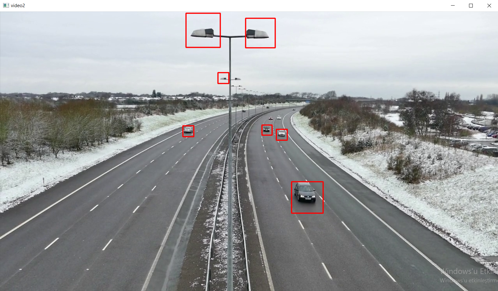

# python-opencv-car-recognition
This Code Is Inspired By These Addresses.<br>
https://www.geeksforgeeks.org/opencv-python-program-vehicle-detection-video-frame/<br>
https://www.youtube.com/watch?v=PXSiUojhNFg<br>
https://e93b3dc1-a-62cb3a1a-s-sites.googlegroups.com/site/andrewssobral/Automatic_Detection_of_Cars_in_Real_Roads_using_Haar-like_Features.pdf<br>
# Setup
```pip install opencv-python```<br>
Link If You Want To Download Separate Video:https://vod-progressive.akamaized.net/exp=1621887977~acl=%2Fvimeo-prod-skyfire-std-us%2F01%2F444%2F6%2F152220070%2F467652565.mp4~hmac=1a944192254df2078291ec44eac76144097a024f760d555d06e5095b191113bc/vimeo-prod-skyfire-std-us/01/444/6/152220070/467652565.mp4?download=1&filename=Roads+-+1952.mp4<br>
# Images:


# owner
eminnesatgurses
